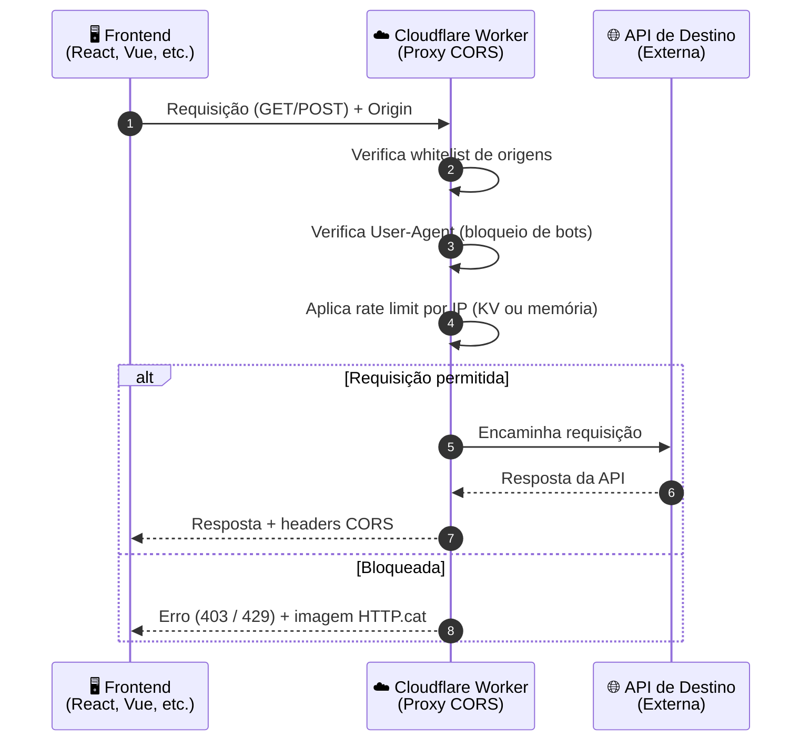

# 🌐 CORS Proxy para Cloudflare Workers

<p align="center">
  <a href="https://deploy.workers.cloudflare.com/?url=https://github.com/ravenastar-js/cors">
    
  </a>
</p>

<p align="center">
  
  
  
</p>

> Proxy CORS robusto para Cloudflare Workers com rate limit, whitelist de origens, bloqueio de bots e cache opcional via KV.

> ## ⚠️ Antes de hospedar, leia isto
> O proxy vem, por padrão, com domínios de **exemplo** na whitelist (`ALLOWED_ORIGINS`), dentro de `src/index.js`:
> ```js
> ALLOWED_ORIGINS: [
>     'https://seudominio.com',
>     'https://www.seudominio.com',
>     'http://localhost:3000',
>     'http://localhost:5500',
>     'http://localhost:8080'
> ]
> ```
> Se você fizer o deploy **sem alterar essa lista**, nenhuma aplicação sua vai conseguir usar o proxy — só os domínios de exemplo (que não são seus) estarão liberados.
> ⚠️ **O botão de [Deploy Rápido](#-deploy-rápido-recomendado) publica o Worker direto na Cloudflare, sem abrir o código para edição antes.** Se você for usar esse botão, edite `ALLOWED_ORIGINS` **depois do deploy**, direto no editor do dashboard da Cloudflare (veja o passo a passo em [Configuração](#-configuração)). Para editar **antes** de publicar, prefira o [Deploy Manual pelo Dashboard](#-deploy-manual-pelo-dashboard) ou o [Deploy via Wrangler CLI](#-deploy-via-wrangler-cli).

---

## 📋 Índice

- [🌐 CORS Proxy para Cloudflare Workers](#-cors-proxy-para-cloudflare-workers)
  - [📋 Índice](#-índice)
  - [🎯 Sobre o Projeto](#-sobre-o-projeto)
    - [Casos de Uso](#casos-de-uso)
  - [✨ Funcionalidades](#-funcionalidades)
  - [🔧 Como Funciona](#-como-funciona)
    - [Fluxo da Requisição](#fluxo-da-requisição)
  - [📋 Pré-requisitos](#-pré-requisitos)
  - [📦 Deploy](#-deploy)
    - [🚀 Deploy Rápido (Recomendado)](#-deploy-rápido-recomendado)
    - [📝 Deploy Manual pelo Dashboard](#-deploy-manual-pelo-dashboard)
    - [💻 Deploy via Wrangler CLI](#-deploy-via-wrangler-cli)
  - [🔧 Configuração](#-configuração)
    - [Variáveis de Configuração](#variáveis-de-configuração)
    - [🔑 Configurar KV (Recomendado)](#-configurar-kv-recomendado)
  - [📡 Uso](#-uso)
    - [URL Base](#url-base)
    - [Parâmetros](#parâmetros)
    - [Métodos Suportados](#métodos-suportados)
  - [📝 Exemplos](#-exemplos)
    - [Requisição GET (curl)](#requisição-get-curl)
    - [Requisição POST (curl)](#requisição-post-curl)
    - [Frontend (JavaScript)](#frontend-javascript)
    - [Frontend com React](#frontend-com-react)
    - [Frontend com Vue](#frontend-com-vue)
    - [Integração com Bibliotecas HTTP](#integração-com-bibliotecas-http)
      - [Axios](#axios)
      - [Fetch (com opções avançadas)](#fetch-com-opções-avançadas)
  - [🛡️ Segurança](#️-segurança)
    - [Headers de Segurança](#headers-de-segurança)
    - [Proteções Implementadas](#proteções-implementadas)
  - [❓ FAQ](#-faq)
  - [📄 Licença](#-licença)
  - [📌 Links Rápidos](#-links-rápidos)
  - [📞 Suporte](#-suporte)
  - [🌟 Star History](#-star-history)
  - [Feito com 💚 por RavenaStar](#feito-com--por-ravenastar)

---

## 🎯 Sobre o Projeto

Este projeto é um **proxy CORS** desenvolvido para Cloudflare Workers que permite que aplicações frontend acessem APIs externas sem serem bloqueadas por políticas de CORS (Cross-Origin Resource Sharing).

Ele atua como um **intermediário**: sua aplicação faz requisições para o Worker, que por sua vez consulta a API de destino e retorna os dados com os headers CORS corretos — tudo isso rodando na borda da rede da Cloudflare, próximo do usuário final.

### Casos de Uso

| Cenário | Como o proxy ajuda |
|---|---|
| 🛠️ **Desenvolvimento local** | Testa APIs que bloqueiam CORS durante o desenvolvimento, sem precisar configurar servidor próprio |
| 📊 **Dashboards** | Consome dados de múltiplas APIs externas sem configurações complexas de cada lado |
| 🔌 **Integrações** | Conecta serviços que não suportam CORS nativamente |
| 🧪 **Testes** | Simula chamadas a APIs em ambientes controlados, com rate limit e whitelist previsíveis |

> 💡 **Dica:** se você só precisa de algo pontual para testes locais, o [Deploy Rápido](#-deploy-rápido-recomendado) coloca um proxy funcional no ar em menos de um minuto.

---

## ✨ Funcionalidades

| Funcionalidade | Descrição |
|----------------|-----------|
| 🔒 **Whitelist de origens** | Apenas domínios autorizados podem usar o proxy |
| ⏱️ **Rate limit por IP** | Limite de requisições por IP, configurável em segundos |
| 🛡️ **Bloqueio de bots** | User-Agents conhecidos (curl, Postman, etc.) são bloqueados |
| 🐱 **HTTP.cat integrado** | Respostas de erro acompanhadas de gatos ilustrativos |
| 🔄 **Suporte GET/POST** | Proxy completo para requisições GET e POST |
| ⚡ **CORS nativo** | Headers CORS configurados automaticamente em toda resposta |
| 💾 **KV opcional** | Rate limit persistente entre deploys, com fallback automático em memória |
| 🚀 **Alta performance** | Executado na borda (edge) da Cloudflare, próximo do usuário |
| 📦 **Zero configuração** | Funciona imediatamente após o deploy, sem passos extras |

---

## 🔧 Como Funciona

O diagrama abaixo resume o caminho de uma requisição, da aplicação frontend até a API de destino e de volta:



### Fluxo da Requisição

1. O **frontend** faz uma requisição para o Worker, informando a URL de destino via parâmetro `url`.
2. O **Worker verifica a origem** da requisição contra a whitelist configurada.
3. Em seguida, verifica se o **User-Agent** não pertence à lista de bots/clientes bloqueados.
4. Aplica o **rate limit por IP**, usando KV (se configurado) ou memória local.
5. Se tudo estiver certo, o Worker **encaminha a requisição** para a API de destino.
6. Por fim, **retorna a resposta** ao frontend já com os headers CORS corretos.

---

## 📋 Pré-requisitos

- Conta [Cloudflare](https://dash.cloudflare.com/sign-up) (gratuita)
- *(Opcional)* Node.js e npm, para deploy via Wrangler CLI
- *(Opcional)* KV Namespace, para rate limit persistente entre deploys

---

## 📦 Deploy

### 🚀 Deploy Rápido (Recomendado)

Clique no botão abaixo para fazer o deploy automático:

<p align="left">
  <a href="https://deploy.workers.cloudflare.com/?url=https://github.com/ravenastar-js/cors">
    
  </a>
</p>

> ⚠️ **Importante:** esse botão publica o Worker imediatamente, com a lista `ALLOWED_ORIGINS` de exemplo. Depois do deploy, **acesse o dashboard da Cloudflare, edite `src/index.js` e substitua os domínios de exemplo pelos seus próprios domínios** (veja [Variáveis de Configuração](#variáveis-de-configuração)). Enquanto isso não for feito, requisições vindas do seu site serão bloqueadas com erro `403`.

### 📝 Deploy Manual pelo Dashboard

1. Acesse [Cloudflare Workers](https://dash.cloudflare.com/?to=/:account/workers)
2. Clique em **Create Worker**
3. Cole o código de `src/index.js`
4. Clique em **Save and Deploy**
5. Anote a URL do seu Worker (ex: `https://seu-worker.workers.dev`)

### 💻 Deploy via Wrangler CLI

```bash
# Clone o repositório
git clone https://github.com/ravenastar-js/cors.git
cd cors

# Instale as dependências
npm install

# Teste localmente
npm run dev

# Faça o deploy
npm run deploy
```

> ⚠️ **Atenção:** confirme se você está autenticado no Wrangler (`wrangler login`) antes de rodar `npm run deploy`.

---

## 🔧 Configuração

### Variáveis de Configuração

Edite o objeto `CONFIG` no `src/index.js`:

```js
const CONFIG = {
    RATE_WINDOW: 60,        // Janela de tempo em segundos
    RATE_LIMIT: 30,         // Requisições máximas por janela
    ALLOWED_ORIGINS: [      // Domínios autorizados (whitelist)
        'https://seudominio.com',
        'https://www.seudominio.com',
        'http://localhost:3000',
        'http://localhost:5500'
    ],
    BLOCKED_AGENTS: [       // User-Agents bloqueados
        'Postman',
        'curl',
        'python-requests',
        'Go-http-client',
        'node-fetch',
        'axios',
        'insomnia',
        'bruno'
    ]
};
```

| Campo | Tipo | Descrição |
|---|---|---|
| `RATE_WINDOW` | `number` | Duração da janela de contagem do rate limit, em segundos |
| `RATE_LIMIT` | `number` | Quantidade máxima de requisições permitidas dentro da janela |
| `ALLOWED_ORIGINS` | `string[]` | Lista de domínios autorizados a usar o proxy |
| `BLOCKED_AGENTS` | `string[]` | Trechos de User-Agent que, se detectados, bloqueiam a requisição |

> 🚨 **Obrigatório:** `ALLOWED_ORIGINS` vem preenchido apenas com domínios de **exemplo**. Substitua todos eles pelos domínios reais da sua aplicação (e remova os `localhost` de exemplo se não forem usados) antes — ou logo depois — de colocar o Worker no ar. Sem esse ajuste, o proxy bloqueia todas as origens que não sejam as de exemplo, com erro `403 - 🔒 Origem não autorizada`.

### 🔑 Configurar KV (Recomendado)

Para rate limit persistente entre deploys:

1. No dashboard do Worker, vá em **Settings** > **Variables**
2. Em **KV Namespace Bindings**, clique em **Add binding**
3. Nome da variável: `KV`
4. Selecione um namespace existente ou crie um novo
5. Clique em **Save and Deploy**

> ⚠️ **Sem KV**, o rate limit funciona normalmente, mas os contadores reiniciam a cada novo deploy.

---

## 📡 Uso

### URL Base

```
https://seu-worker.workers.dev/?url=https://api-destino.com/endpoint
```

### Parâmetros

| Parâmetro | Descrição | Obrigatório |
|-----------|-----------|:---:|
| `url` | URL codificada da API de destino | ✅ Sim |

### Métodos Suportados

| Método | Uso |
|---|---|
| `GET` | Consultas simples |
| `POST` | Envio de dados (JSON) |
| `OPTIONS` | Preflight CORS (tratado automaticamente pelo Worker) |

---

## 📝 Exemplos

### Requisição GET (curl)

```bash
curl "https://seu-worker.workers.dev/?url=https://api.github.com/users/octocat"
```

### Requisição POST (curl)

```bash
curl -X POST "https://seu-worker.workers.dev/?url=https://api.exemplo.com/dados" \
  -H "Content-Type: application/json" \
  -d '{"nome": "João", "email": "joao@email.com"}'
```

### Frontend (JavaScript)

```js
fetch('https://seu-worker.workers.dev/?url=https://api.exemplo.com/dados', {
    method: 'GET',
    headers: { 'Accept': 'application/json' }
})
.then(response => response.json())
.then(data => console.log('Dados:', data))
.catch(error => console.error('Erro:', error));
```

### Frontend com React

```jsx
import React, { useState, useEffect } from 'react';

const App = () => {
    const [dados, setDados] = useState(null);
    const [carregando, setCarregando] = useState(false);
    const [erro, setErro] = useState(null);

    const buscarDados = async () => {
        setCarregando(true);
        setErro(null);
        try {
            const response = await fetch(
                'https://seu-worker.workers.dev/?url=https://api.exemplo.com/dados'
            );
            const data = await response.json();
            setDados(data);
        } catch (err) {
            setErro(err.message);
        } finally {
            setCarregando(false);
        }
    };

    return (
        <div>
            <button onClick={buscarDados}>Buscar Dados</button>
            {carregando && <p>Carregando...</p>}
            {erro && <p style={{ color: 'red' }}>Erro: {erro}</p>}
            {dados && <pre>{JSON.stringify(dados, null, 2)}</pre>}
        </div>
    );
};

export default App;
```

### Frontend com Vue

```vue
<template>
  <div>
    <button @click="buscarDados">Buscar Dados</button>
    <p v-if="carregando">Carregando...</p>
    <p v-if="erro" style="color: red;">Erro: {{ erro }}</p>
    <pre v-if="dados">{{ JSON.stringify(dados, null, 2) }}</pre>
  </div>
</template>

<script>
export default {
  data() {
    return {
      dados: null,
      carregando: false,
      erro: null
    };
  },
  methods: {
    async buscarDados() {
      this.carregando = true;
      this.erro = null;
      try {
        const response = await fetch(
          'https://seu-worker.workers.dev/?url=https://api.exemplo.com/dados'
        );
        this.dados = await response.json();
      } catch (err) {
        this.erro = err.message;
      } finally {
        this.carregando = false;
      }
    }
  }
};
</script>
```

### Integração com Bibliotecas HTTP

#### Axios

```js
import axios from 'axios';

const proxyUrl = 'https://seu-worker.workers.dev';
const targetUrl = 'https://api.exemplo.com/dados';

axios.get(`${proxyUrl}/?url=${encodeURIComponent(targetUrl)}`)
    .then(response => console.log(response.data))
    .catch(error => console.error(error));
```

#### Fetch (com opções avançadas)

```js
const proxyUrl = 'https://seu-worker.workers.dev';
const targetUrl = 'https://api.exemplo.com/dados';

const response = await fetch(`${proxyUrl}/?url=${encodeURIComponent(targetUrl)}`, {
    method: 'POST',
    headers: {
        'Content-Type': 'application/json',
        'Authorization': 'Bearer token_aqui'
    },
    body: JSON.stringify({ chave: 'valor' })
});

const data = await response.json();
```

> 💡 **Dica:** sempre use `encodeURIComponent()` na URL de destino para evitar problemas com caracteres especiais e parâmetros de query.

---

## 🛡️ Segurança

### Headers de Segurança

O Worker inclui os seguintes headers em todas as respostas:

| Header | Valor | Descrição |
|--------|-------|-----------|
| `Cache-Control` | `no-cache, no-store, must-revalidate` | Impede cache de dados potencialmente sensíveis |
| `X-RateLimit-Remaining` | Número | Mostra quantas requisições restam na janela atual |
| `X-Proxy` | `CORS-Proxy-Worker` | Identifica que a resposta passou pelo proxy |

### Proteções Implementadas

- ✅ **Whitelist de origens** — apenas domínios autorizados podem usar o proxy
- ✅ **Rate limit por IP** — previne abuso e uso excessivo
- ✅ **Bloqueio de bots** — User-Agents conhecidos (curl, Postman, etc.) são recusados
- ✅ **Proteção contra proxy encadeado** — impede que o Worker seja usado como relay para outro proxy
- ✅ **Validação de URL** — apenas URLs `http://` ou `https://` são aceitas

---

## ❓ FAQ

<details>
<summary><strong>O que é CORS?</strong></summary><br>

CORS (Cross-Origin Resource Sharing) é uma política de segurança do navegador que impede que um site faça requisições para um domínio diferente do seu, a menos que esse domínio autorize explicitamente. Este proxy contorna esse bloqueio de forma controlada.
</details>

<details>
<summary><strong>Preciso de uma conta paga da Cloudflare?</strong></summary><br>

Não. O plano gratuito do Cloudflare Workers oferece 100.000 requisições por dia, o que é suficiente para a maioria dos projetos.
</details>

<details>
<summary><strong>Como faço para usar com HTTPS?</strong></summary><br>

O Worker já suporta HTTPS nativamente. Basta usar `https://` na URL do seu Worker.
</details>

<details>
<summary><strong>Posso usar com APIs que exigem autenticação?</strong></summary><br>

Sim. Você pode enviar headers de autenticação (como `Authorization`) nas requisições, tanto em GET quanto em POST.
</details>

<details>
<summary><strong>O rate limit é por IP ou por usuário?</strong></summary><br>

O rate limit é aplicado por IP do cliente, garantindo que cada usuário tenha seu próprio limite independente.
</details>

<details>
<summary><strong>Como vejo o status do rate limit?</strong></summary><br>

O header de resposta `X-RateLimit-Remaining` mostra quantas requisições ainda restam na janela atual.
</details>

<details>
<summary><strong>Posso aumentar o rate limit?</strong></summary><br>

Sim. Basta alterar a variável `RATE_LIMIT` no arquivo `src/index.js` e reimplantar o Worker.
</details>

<details>
<summary><strong>O que acontece se eu atingir o rate limit?</strong></summary><br>

O Worker retorna um erro `429 Too Many Requests`, junto com o tempo de espera recomendado.
</details>

<details>
<summary><strong>Como faço para limpar o cache do KV?</strong></summary><br>

O cache do KV expira automaticamente conforme a janela configurada, mas também pode ser limpo manualmente pelo dashboard da Cloudflare.
</details>

<details>
<summary><strong>Posso usar com WebSockets?</strong></summary><br>

Não. Este proxy foi projetado apenas para requisições HTTP/HTTPS convencionais (GET, POST, OPTIONS).
</details>

---

## 📄 Licença

Este projeto está licenciado sob a **Licença MIT** — veja o arquivo [LICENSE](LICENSE) para mais detalhes.

---

## 📌 Links Rápidos

| Recurso | Link |
|---|---|
| ☁️ Cloudflare Workers | [workers.cloudflare.com](https://workers.cloudflare.com/) |
| 📖 Documentação da API | [developers.cloudflare.com/workers](https://developers.cloudflare.com/workers/) |
| 🐱 HTTP.cat | [http.cat](https://http.cat/) |
| 📘 CORS na MDN | [developer.mozilla.org — CORS](https://developer.mozilla.org/pt-BR/docs/Web/HTTP/CORS) |

---

## 📞 Suporte

[](https://discord.gg/FncVNprdgP)

---

## 🌟 Star History

<a href="https://www.star-history.com/#ravenastar-js/cors&type=date&legend=top-left">
 <picture>
   <source media="(prefers-color-scheme: dark)" srcset="https://api.star-history.com/image?repos=ravenastar-js/cors&type=date&theme=dark&legend=top-left" />
   <source media="(prefers-color-scheme: light)" srcset="https://api.star-history.com/image?repos=ravenastar-js/cors&type=date&legend=top-left" />
   
 </picture>
</a>

---

<div align="center">

## Feito com 💚 por [RavenaStar](https://ravenastar.com)

</div>